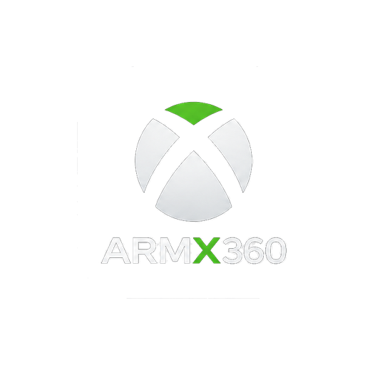

<p align="center">
       
    </a>
</p>

<h1 align="center">ARMX360 - Android Xbox 360 Emulator</h1>

> A fork of [XenDroid](https://github.com/rfandango/XenDroid), which was itself
> forked from xa360e / [Xenia Canary](https://github.com/xenia-canary/xenia-canary)
> and later rebased onto [Xenia Edge](https://github.com/has207/xenia-edge).

## History
ARMX360 is a fork of **XenDroid**, which was initially forked form xa360e, which was based off [Xenia Canary](https://github.com/xenia-canary/xenia-canary).
However, a complete rebase was made on [Xenia Edge](https://github.com/has207/xenia-edge) with a new Kotlin backend.
We are looking foward to keep the project updated alongside the Edge fork,
and keep the code compatible with Xenia licenses.

## About this fork
The application id is now `armx360.compose`, so ARMX360 installs **alongside**
an upstream XenDroid build rather than replacing it. The debug variant is
`armx360.compose.debug`. The Java/Kotlin package (`xendroid.compose`) and the
native JNI class names are deliberately **unchanged** -- `libe.so` resolves
those classes by FQN string, so renaming them would be a device-only runtime
risk for no user-visible benefit.

Set your fork's release repo before publishing a build, or the in-app updater
will keep polling upstream XenDroid's releases:
```bash
./gradlew assembleRelease -Parmx360.releaseRepo=<owner>/<repo>
```
CI sets this automatically from the running repository.

## Be aware of scams
- ARMX360 is a free project. If you paid for this, then you got scammed.
- Check this fork's own `releases` section for its APKs, along with the distributed source code.
  - We cannot be held responsible for edited apks by unkown users, you have been warned.

## Issue Reporting
A dedicated repo will be made to do reports. As of now critical issues are known.

In order to give detailed reports, you must compare the android port with `Xenia Edge` using `Vulkan` as a backend. Make sure that the
issues can be reproduced only on Android. If the issues are on Edge too, then we wait for the developers to fix
them, and align the port as a consequence.


## Building

See [BUILD.md](BUILD.md) for build instructions.

## LICENSE

Please check the LICENSE file under the appropriate file header and directory for detailed information.

## Device Requirements
- Snapdragon SoC, GEN 2 or higher
- Adreno GPU 740 or higher. Lower 7xx have not been tested.

## Recommended Drivers
- You can get the drivers for your GPU from two sources 
  - [Whitebelyash upstream drivers](https://github.com/whitebelyash/AdrenoToolsDrivers/releases)
    - This is a All-In-One driver for a wide range of GPUs
  - [StevenMXZ forked drivers](https://github.com/StevenMXZ/Adreno-Tools-Drivers/releases)
    - This one has different drivers for each GPU series
  
# Applying the driver
  - Check your device specs with [CPU X](https://play.google.com/store/apps/details?id=com.abs.cpu_z_advance&hl=it) to get the matching driver.
  - To apply the drivers go to **Settings** > **Vulkan** > **Custom Vulkan Driver**, then select the zip file.

## About Donations
I would like to take this opportunity to help a friend out. If you are willing to make donations, please consider donating to
[Bitshifter's Kofi](https://ko-fi.com/bitsh1ft3r/goal?g=0). He's the maintainer of the [Xenon Project](https://github.com/xenon-emu/xenon)
and every donation can help making a difference for the maintainer.
Thank you - Fabxx
